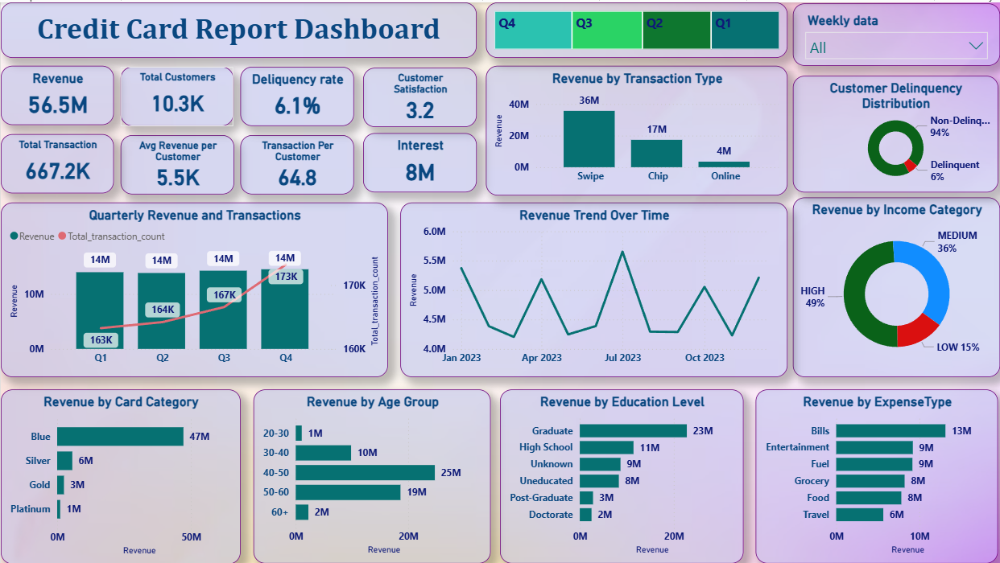

# credit-card-analytics-dashboard
Power BI dashboard analyzing credit card transactions, customer behavior, and risk (delinquency).

## 🎯 Project Objective

The objective of this project is to analyze credit card customer data to understand spending behavior, identify high-value customer segments, and assess credit risk using delinquency patterns.

The dashboard helps businesses make data-driven decisions by providing insights into revenue trends, customer demographics, and transaction behavior.

